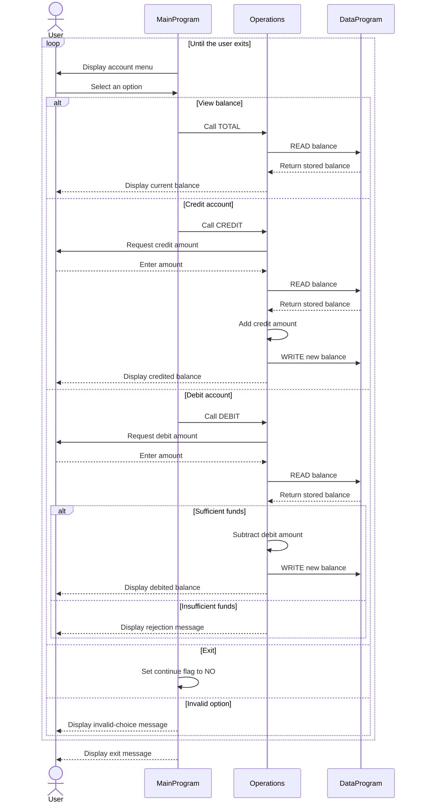

# COBOL School Accounting System

This directory documents the COBOL sample that models a simple school accounting workflow. The program currently manages one shared account balance; it does not yet identify individual students, account types, or transactions.

## Program Responsibilities

### `src/cobol/main.cob`

`MainProgram` is the interactive entry point. It displays the account menu, accepts a user's choice, and delegates the selected operation to `Operations`.

Supported choices are:

- View the current balance
- Credit the account
- Debit the account
- Exit the program

In a school accounting context, these choices can represent checking a student's account, recording a payment such as tuition or a fee, recording an approved charge or refund, and ending the session.

### `src/cobol/operations.cob`

`Operations` contains the business workflow for account activity. It handles the following operations:

- `TOTAL `: Reads and displays the current balance.
- `CREDIT`: Reads an amount, adds it to the balance, and saves the result.
- `DEBIT `: Reads an amount, verifies that sufficient funds are available, subtracts it, and saves the result.

The program delegates all balance reads and writes to `DataProgram` rather than modifying the stored balance directly.

### `src/cobol/data.cob`

`DataProgram` is the data-access component for the balance. It accepts an operation code and a balance value:

- `READ` copies the stored balance to the caller.
- `WRITE` replaces the stored balance with the caller's value.

The sample starts with a balance of `1000.00`. This component currently stores only one balance and has no student ID, database, transaction history, or audit trail.

## Student Account Business Rules

The current implementation applies these rules:

1. A new account starts with a balance of `1000.00`.
2. A credit increases the account balance by the entered amount.
3. A debit decreases the account balance by the entered amount only when the balance is at least that amount.
4. A debit that exceeds the current balance is rejected and leaves the balance unchanged.
5. A successful credit or debit is written back before the new balance is displayed.
6. Invalid menu choices are rejected with a message; the user remains in the menu.
7. The account is not associated with a particular student. Every operation uses the same shared balance.

## Important Scope Limitations

This is a teaching example rather than a complete school accounting system. It does not currently provide:

- Student, guardian, class, or academic-year identification
- Separate balances for tuition, meals, transportation, or other fee categories
- Payment dates, transaction IDs, receipts, refunds, or audit history
- Validation for zero, negative, or malformed monetary amounts
- Persistent storage across program runs

Those capabilities would need to be added before using the program for real student-account processing.

## Application Data Flow

